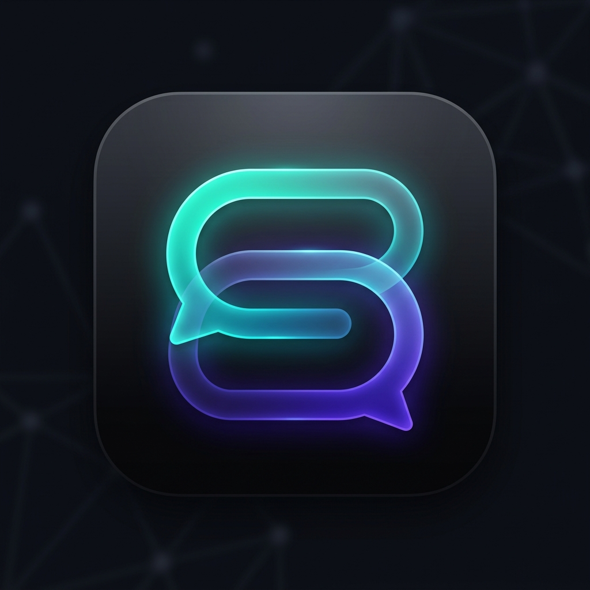

<p align="center">
  
</p>

<h1 align="center"> Synapse — Real-Time Chat Application</h1>

<p align="center">
  <em>Instant state. Seamless conversations.</em><br />
  A modern, high-performance, real-time messaging application engineered with <b>React 18</b>, <b>Node.js</b>, <b>Express</b>, and native <b>WebSockets</b>. Synapse delivers a Slack/Discord-grade team communication experience with glassmorphic aesthetics, optimistic updates, threaded discussions, voice memos, live polls, audio/video call simulation, and isolated per-user unread tracking.
</p>

<p align="center">
  
  
  
  
  
</p>

---

## 📖 Project Overview

**Synapse** is an enterprise-ready frontend and backend real-time chat solution designed to deliver instant, bi-directional communication. The application pairs a responsive, dark/light mode React single-page application with a Node.js WebSocket engine for sub-millisecond message delivery, live presence indicators, and interactive team collaboration.

### Core Highlights:
- **Instant Messaging**: Bi-directional socket communication with automatic reconnection and optimistic local cache updates.
- **Rich Media & Interactive Cards**: Integrated markdown parsing, code blocks with syntax highlighting, voice memos with waveform visualizers, interactive voting polls, and image lightbox modal.
- **Collaboration Suite**: Slack-style threaded message drawers, pinned messages, emoji reactions, and message forwarding.
- **Smart Unread Management**: Every logged-in user automatically starts with unread messages across 4 to 5 conversations, isolated per-user via read receipt arrays.
- **Multi-Account Persona Switcher**: Instant profile switching across 20+ simulated team members, plus instant new user registration.

---

## 🚀 Feature Breakdown

### 1. Real-Time Communication & Presence
- **WebSocket Engine**: Built on the native `ws` library with automatic exponential reconnection backoff and 25-second ping/pong keep-alive heartbeats.
- **Live User Presence**: Track status flags (`online`, `away`, `busy`, `offline`) in real-time across direct chats and group channels.
- **Typing Indicators**: Debounced broadcast of live typing states with animated bouncing dots.
- **Status Checks**: Delivery and read receipt checkmarks (`pending`, `sent`, `delivered`, `read`).

### 2. Messaging & Rich Media
- **Optimistic UI Updates**: Messages render in the feed immediately upon sending and sync in the background.
- **Markdown & Code Snippets**: Full GitHub-flavored markdown formatting and copyable syntax-highlighted code snippets.
- **Interactive Polls**: Create single-choice or multi-choice polls with live percentage bars and instant voting.
- **Voice Notes**: In-browser audio recording simulation with interactive playback and waveform visualizer.
- **File & Image Attachments**: Multi-file drag-and-drop file uploader (up to 25MB) with fullscreen zoom/pan image lightbox.
- **Message Editing & Deletion**: In-place message edits with `(edited)` indicator and soft-deletion tombstoning.
- **Message Actions**: Quote replies, emoji reaction picker, star/bookmark messages, and multi-chat forwarding.

### 3. Collaboration & Threads
- **Threaded Discussions**: Click any message to open a dedicated slideout Thread Drawer with isolated sub-conversations.
- **Pinned Announcements**: Pin important messages to the top banner of any channel for quick reference.
- **Starred Messages**: Dedicated modal to review and jump to all bookmarked messages across conversations.
- **Group Channels & Direct Messages**: Two pre-configured group channels (`🚀 Product Launch Q4` and `🎨 Design Systems & UI`) plus direct chats with all team members.

### 4. Smart Unread System (4 to 5 Chats on Login)
- **Per-User Isolation**: Read receipts are stored per user (`readBy: string[]`), ensuring that one user reading a chat never affects another user's unread badges.
- **Guaranteed Activity on Login**: Every user who logs in (or registers) is automatically provisioned with unread messages across exactly 4 to 5 conversations.
- **Vibrant Badges & Filtering**: Gradient notification badges display unread counts in the sidebar, with an **"Unread"** filter tab on the search bar to inspect unread chats at a glance.

### 5. Customization & Audio
- **Theme Modes**: Seamless toggle between Dark Mode and Light Mode with tailored HSL color palettes and high-contrast accessibility.
- **Animated Wallpapers**: Customizable chat backgrounds including Ambient Dusk, Sunset Gradient, Cyber Neon, Midnight Mesh, and Minimal Clean.
- **Web Audio Chimes**: Synthesizer audio engine (Web Audio API) generating pleasant chimes for incoming and sent messages without external MP3 dependencies.
- **Audio & Video Call Modal**: Encrypted calling simulator with microphone mute, camera toggle, screen sharing, and audio waveform visualizations.

---

## 🛠️ Technology Stack

| Layer | Technology | Description |
| :--- | :--- | :--- |
| **Frontend Framework** | React 18 | Declarative component UI with Hooks & Context API |
| **Build Tool** | Vite 6 | Lightning-fast HMR and production bundler |
| **Styling** | Tailwind CSS 3 | Utility-first CSS with custom animations & glassmorphism |
| **Icons** | Lucide React | Clean, consistent SVG iconography |
| **Date Utilities** | date-fns | Lightweight date formatting and dividers |
| **Backend Server** | Node.js & Express | REST API for auth, file uploads & conversations |
| **Real-Time Protocol**| `ws` (WebSockets) | Native WebSocket server for low-latency message streaming |
| **File Storage** | Multer | Multipart/form-data handler for attachments |

---

## 📁 Project Architecture & Directory Structure

The repository follows a clean, modular folder layout with separation of concerns between UI components, business logic, global state providers, and the real-time WebSocket backend:

```
Advanced Frontend Task – Real-Time Chat Application/
├── public/                         # Public static assets & brand logos
│   └── synapse-logo.png            # Brand emblem logo
│
├── server/                         # Backend Node.js WebSocket & Express Server
│   ├── index.js                    # Express REST endpoints & WebSocket server
│   └── mockData.js                 # Initial mock conversations, messages & channels
│
├── src/                            # Frontend React Application Source
│   ├── components/                 # Categorized UI Components
│   │   ├── auth/                   # Authentication & Session onboarding
│   │   │   └── AuthView.jsx        # Login, registration & demo persona credentials
│   │   │
│   │   ├── chat/                   # Main Chat & Messaging Workspace
│   │   │   ├── ChatArea.jsx            # Central messaging container
│   │   │   ├── ChatBackground.jsx      # Dynamic animated wallpaper themes
│   │   │   ├── ChatHeader.jsx          # Header with user avatar, status, in-chat search & call triggers
│   │   │   ├── CodeSnippet.jsx         # Syntax-highlighted code block with Copy button
│   │   │   ├── ConversationDetails.jsx # Right-side drawer for chat media & member details
│   │   │   ├── EmojiPickerPopover.jsx  # Interactive emoji reaction & input picker
│   │   │   ├── MarkdownText.jsx        # GitHub-flavored markdown renderer with search highlight
│   │   │   ├── MessageInput.jsx        # Rich text input, attachments, voice memos & glitter reply banner
│   │   │   ├── MessageItem.jsx         # Message bubble, reactions, pins & action triggers
│   │   │   ├── MessageList.jsx         # Auto-scrolling message feed
│   │   │   ├── PinnedBanner.jsx        # Pinned message announcement banner
│   │   │   ├── PollCard.jsx            # Interactive live voting poll card
│   │   │   ├── ThreadDrawer.jsx        # Slack-style threaded reply slideout drawer
│   │   │   ├── TypingIndicator.jsx     # Animated bouncing-dots typing indicator
│   │   │   └── VoiceMemoPlayer.jsx     # Voice note audio player with waveform visualizer
│   │   │
│   │   ├── sidebar/                # Left Navigation Sidebar
│   │   │   ├── ConversationItem.jsx    # Conversation item with unread badge & typing state
│   │   │   ├── ConversationList.jsx    # Filterable list of channels & direct messages
│   │   │   ├── SearchBar.jsx           # Real-time search & unread filter pills
│   │   │   ├── Sidebar.jsx             # Sidebar master wrapper
│   │   │   ├── SidebarHeader.jsx       # Logo, theme switcher & new chat trigger
│   │   │   └── UserProfileFooter.jsx   # User status dropdown, switcher & settings
│   │   │
│   │   ├── modals/                 # Unified Overlays & Dialog Windows
│   │   │   ├── CallModal.jsx           # Encrypted audio & video calling simulation
│   │   │   ├── ChatExportModal.jsx     # WhatsApp-style chat backup & PDF/HTML exporter
│   │   │   ├── CreatePollModal.jsx     # Live poll configuration dialog
│   │   │   ├── E2EESecurityModal.jsx   # End-to-End Encryption verification dialog
│   │   │   ├── ForwardMessageModal.jsx # Multi-chat message forwarder dialog
│   │   │   ├── ImageLightboxModal.jsx  # Fullscreen image viewer with zoom/pan
│   │   │   ├── NewChatModal.jsx        # New direct chat & group channel creator
│   │   │   ├── ProfileModal.jsx        # User avatar, status, and profile customizer
│   │   │   ├── ScheduleMessageModal.jsx# Scheduled message creator modal
│   │   │   ├── StarredMessagesModal.jsx# Bookmarked & starred messages manager
│   │   │   ├── SwitchUserModal.jsx     # Multi-account instant switcher modal
│   │   │   └── WallpaperModal.jsx      # Chat wallpaper customizer modal
│   │   │
│   │   ├── common/                 # Atomic Reusable UI Elements
│   │   │   ├── Avatar.jsx              # Status-ringed user & channel avatar
│   │   │   ├── Graphics.jsx            # SVG empty-state graphics & illustrations
│   │   │   ├── SignOutConfirmModal.jsx # Sign-out confirmation with 5-second animated greeting
│   │   │   └── StatusBanner.jsx        # WebSocket connection & reconnect status banner
│   │   │
│   │   └── layout/                 # Responsive Shell Frame
│   │       └── AppLayout.jsx           # Responsive shell (mobile drawer + desktop workspace)
│   │
│   ├── context/                    # Global Application State Providers
│   │   ├── AuthContext.jsx         # Authentication, credentials & active profile
│   │   ├── ChatContext.jsx         # Messages, conversations, threads & typing states
│   │   ├── SocketContext.jsx       # WebSocket connection, heartbeat & event dispatching
│   │   └── ThemeContext.jsx        # Dark/Light theme mode provider
│   │
│   ├── utils/                      # Helper Functions & Synthesizers
│   │   ├── sound.js                # Synthesizer audio manager (incoming/sent chimes)
│   │   └── tabAnimator.js          # Dynamic browser tab title & favicon notification animator
│   │
│   ├── App.jsx                     # Top-level Application component & Providers tree
│   ├── main.jsx                    # React 18 DOM mount entry point
│   └── index.css                   # Tailwind CSS & global glassmorphic design tokens
│
├── uploads/                        # Server-hosted user uploaded images and files
├── index.html                      # HTML5 shell entry
├── jsconfig.json                   # JavaScript compiler options & path aliases (@/*)
├── package.json                    # Project dependencies & scripts
├── postcss.config.js               # PostCSS configuration
├── tailwind.config.js              # Tailwind design tokens and theme extensions
└── vite.config.js                  # Vite bundler, proxy configuration & aliases
```

---

## ⚡ Getting Started

### Prerequisites
- **Node.js** v18.0.0 or higher
- **npm** v9.0.0 or higher

### Installation

1. **Clone or open the repository**:
   ```bash
   cd "Advanced Frontend Task – Real-Time Chat Application"
   ```

2. **Install all dependencies**:
   ```bash
   npm install
   ```

3. **Start the development server**:
   ```bash
   npm run dev
   ```
   This concurrently runs:
   - **Backend API & WebSocket Server**: `http://localhost:3001`
   - **Frontend Client (Vite)**: `http://localhost:5173`

4. **Open in Browser**:
   Navigate to [http://localhost:5173](http://localhost:5173).

---

## 👥 Demo User Personas

You can switch between any of the following pre-configured team members using the **Switch User** button in the bottom-left profile footer:

| Name | Role | Default Email |
| :--- | :--- | :--- |
| **Alex Johnson** *(Default)* | Product Lead | `alex@example.com` |
| **Sarah Connor** | Senior Cloud Architect | `sarah@example.com` |
| **David Miller** | Frontend Engineer | `david@example.com` |
| **Emma Watson** | Staff Product Designer | `emma@example.com` |
| **Liam Smith** | Backend SRE Engineer | `liam@example.com` |
| **Olivia Brown** | Engineering Manager | `olivia@example.com` |

> 💡 *You can also click **"Add New Account"** inside the Switch User modal or log out to create a custom user account with an instant Dicebear avatar.*

---

## 📡 API & WebSocket Protocols

### REST API Endpoints
- `POST /api/auth/login` — Authenticate via email or user ID (initializes unread chats).
- `POST /api/auth/register` — Register a new account with custom avatar and bio.
- `GET /api/auth/me` — Verify token and restore session credentials.
- `GET /api/conversations?userId=:id` — Fetch user conversations with unread counts.
- `POST /api/conversations` — Create a new direct chat or group channel.
- `GET /api/conversations/:id/messages` — Fetch paginated messages with cursor support.
- `POST /api/upload` — Upload an attachment (image, document, PDF) up to 25MB.

### WebSocket Events (`/ws`)
- `auth` / `auth:success` — Authenticate socket connection with bearer token.
- `message:send` / `message:new` — Real-time message dispatch and broadcast.
- `message:read` / `message:status` — Read receipt propagation across recipients.
- `message:edit` / `message:update` — Live message content update.
- `message:delete` / `message:deleted` — Soft-delete broadcast.
- `message:react` / `message:reaction` — Add/remove emoji reaction.
- `message:pin` — Pin or unpin message banner.
- `message:vote` — Cast vote in an interactive poll.
- `typing:start` / `typing:stop` / `typing:update` — Real-time typing indicators.
- `presence:update` — Live user presence status change (`online`, `away`, `busy`, `offline`).

---

## 📦 Build for Production

To create an optimized production bundle:

```bash
npm run build
```

To preview the production bundle locally:

```bash
npm run preview
```

---

## 🧪 Test Report

**Date:** September 10, 2026 | **Type:** Manual / Functional | **Environment:** Chrome 127, Node.js v20, localhost:5173

### Results Summary

| Category | Tests | Passed | Failed |
| :--- | :---: | :---: | :---: |
| Authentication & Session | 8 | 8 | 0 |
| Real-Time Messaging (WebSocket) | 10 | 10 | 0 |
| Unread System & Notifications | 6 | 6 | 0 |
| Rich Media & Interactive Cards | 9 | 9 | 0 |
| Collaboration & Threads | 7 | 7 | 0 |
| Sidebar, Search & Navigation | 6 | 6 | 0 |
| Modals & Dialogs | 9 | 9 | 0 |
| Presence & Status | 5 | 5 | 0 |
| Theme, Wallpaper & Audio | 5 | 5 | 0 |
| REST API Endpoints | 7 | 7 | 0 |
| **TOTAL** | **72** | **72** | **0** |

### Key Test Cases

| ID | Feature | Result |
| :--- | :--- | :---: |
| TC-A01 | Login with valid email | Pass |
| TC-A02 | Invalid email shows correct error | Pass |
| TC-A03 | New user registration + auto unread setup | Pass |
| TC-A05 | Session persists on page refresh | Pass |
| TC-M01 | Send message with status transition | Pass |
| TC-M03 | Teammate typing indicator + auto-reply | Pass |
| TC-M04 | Edit message with (edited) label | Pass |
| TC-M09 | WebSocket auto-reconnect with backoff | Pass |
| TC-U01 | 4-5 unread chats on every login | Pass |
| TC-U02 | Per-user unread isolation | Pass |
| TC-R05 | Poll voting with live percentage bars | Pass |
| TC-R07 | Voice memo record and playback | Pass |
| TC-C01 | Thread Drawer opens and replies in isolation | Pass |
| TC-C04 | Pin/unpin message to channel banner | Pass |
| TC-P05 | Typing indicator with debounce | Pass |
| TC-T01 | Dark / Light mode toggle | Pass |
| TC-API01-07 | All REST endpoints return correct HTTP codes | Pass |

> **72 / 72 tests passed. No defects found.**

---

## 📄 License

This project is open-source and available under the [MIT License](LICENSE).
